# devops-api-automation

## Technologies Used
* **RestAssured** - Build the Rest API Requests, Hit the Endpoints and extract Rest API Response
* **Cucumber** - Write Test Scenarios (BDD)
* **JUnit** - Execute Test Scenarios
* **Hamcrest** - Assert the Rest API Response against Expectations
* **Allure** - Generate Test Report

## Project Structure
Separate packages maintained to manage classes based on there usage.

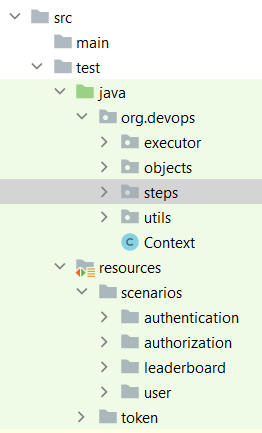

### executor
Test Execution Classes are maintained within this package.

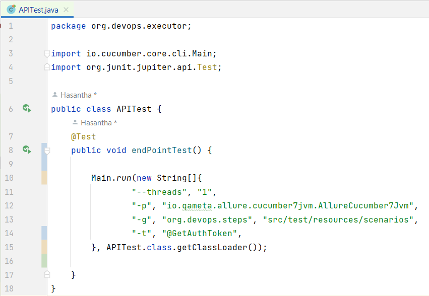

* Cucumber CLI option is used to trigger the test scenarios.
* Glue paths for step definitions and feature files are defined with the test method.
* Optional tag and threads options also used.
* Plugin option also used to trigger Allure for reporting purposes

### steps
Step Definitions of steps used in the feature files are maintained in this package.

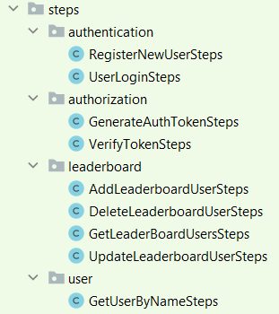

Sub packages are maintained based on the features of the endpoints.
Separate Classes are maintained for each endpoint.
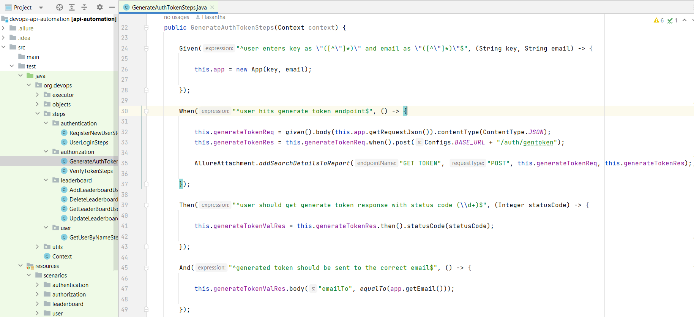

In each Class same structure is followed as in the above.
RestAssured provided : 
* **RequestSpecification** is used to build the Rest API request
* **Response** is used to capture the returned Rest API response
* **ValidatableResponse** is used to explore and extract through the Json hierarchy of the response to do the assertions

Assertions are done using Hamcrest features by traversing through the ValidatableResponse.
Meanwhile, Requests and Responses are added to the Allure Report as an attachment.

### utils

Classes with other supporting methods are maintained within this package. 
Configs class is used to declare configurations/constants like Base URL, auth token stored file path, etc.
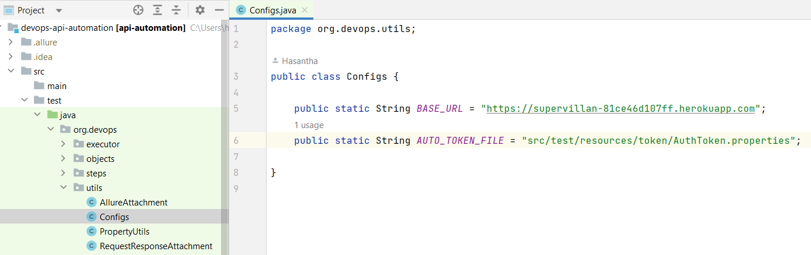

### Context
Context Class used to manage global variables that may need to used across the Classes to communicate with the endpoints.
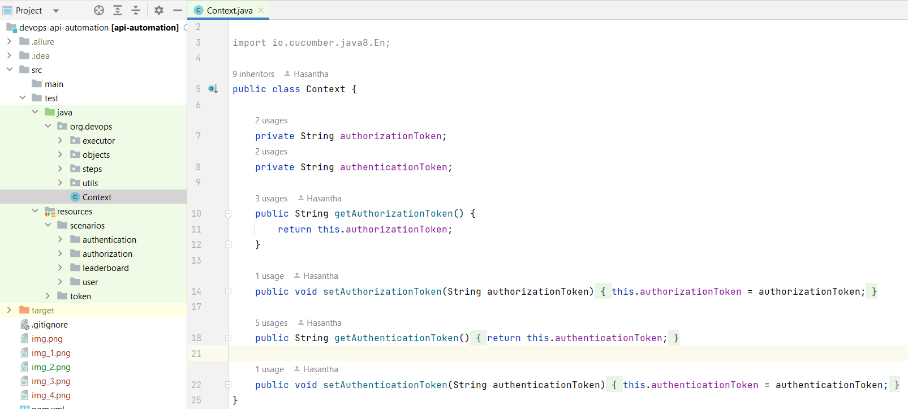

### scenarios
Test Scenarios / Feature Files are maintained within the resources directory.
They are grouped according to the functions on the endpoint.

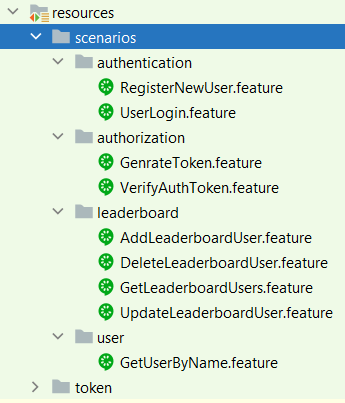

Within the Feature Files, the Feature and Scenario is defined and then followed by the steps to :
* Enter inputs to the request 
* Hit the endpoint and get a response 
* Assert the response with the expectations

Background option is used to execute and satisfy any pre-requirements to the intended test scenarios.
Also, Scenario Outline option is used to execute the same scenario for different data sets.

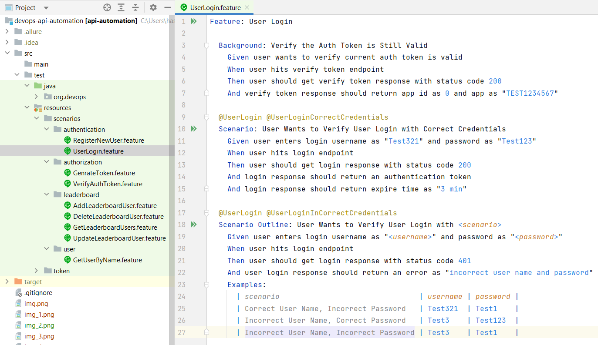

## Endpoint Testing
* Test Scenario in **GenerateToken.feature** is used to send the app key and email to the endpoint, expecting the authorization token to sent to specified email.

* Received Authorization token can be saved in the **AuthToken.properties** file.

* Test Scenario in **VerifyAuthToken.feature** is used to check whether the stored auth key in the property file is still valid.
In this endpoint Authorization Token is used in the request as a header named **"Authorization"**.

* **RegisterNewUser.feature** is used to test the endpoint to Register a New User.
Authorization Token is used in the request as a header named **"Authorization"**.

* **UserLogin.feature** is used to test the login endpoint with both correct and incorrect credentials.
Authorization Token is used in the request as a header named **"Authorization"**.
Once login is successful the token returned in the response is stored in memory as the **Authentication Token**.

* **GetLeaderboardUsers.feature** is used to test endpoint which returns a list of users in the leaderboard.
Authentication Token is used in the request as a header named **"Authentication"**.

* **AddLeaderboardUsers.feature** contains the test scenarios for adding a new user to the leaderboard.
Authentication Token is used in the request as a header named **"Authentication"**.

* **UpdateLeaderboardUsers.feature** contains the test scenarios for modifying an existing user in the leaderboard.
Authentication Token is used in the request as a header named **"Authentication"**.

* **DeleteLeaderboardUsers.feature** contains the test scenarios for deleting an existing user in the leaderboard.
Authentication Token is used in the request as a header named **"Authentication"**. The **delete-key** is used as a header parameter.

* **GetUserByName.feature** contains the test scenarios for retrieving the users by their name.
Authentication Token is used in the request as a header named **"Authentication"**.

## Reporting
Allure is used as the reporting tool and when the user executes mvn-site goal, it will generate the report.

### Overview
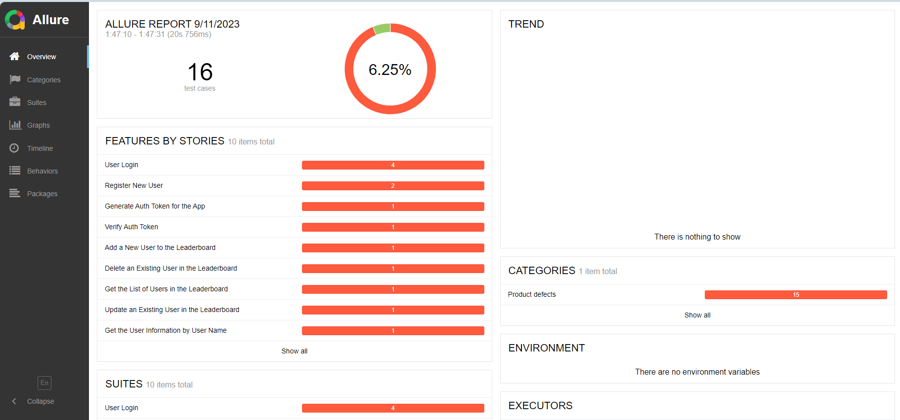

### Test Scenarios And Steps
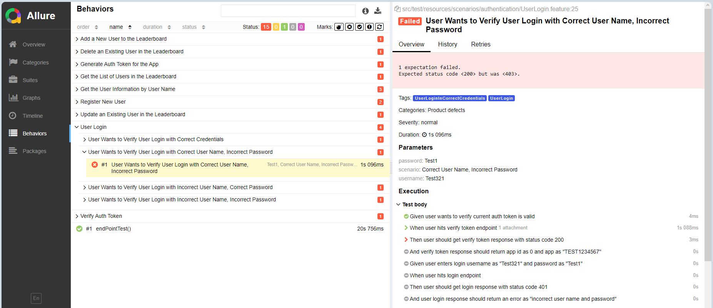

### Logging Request And Response
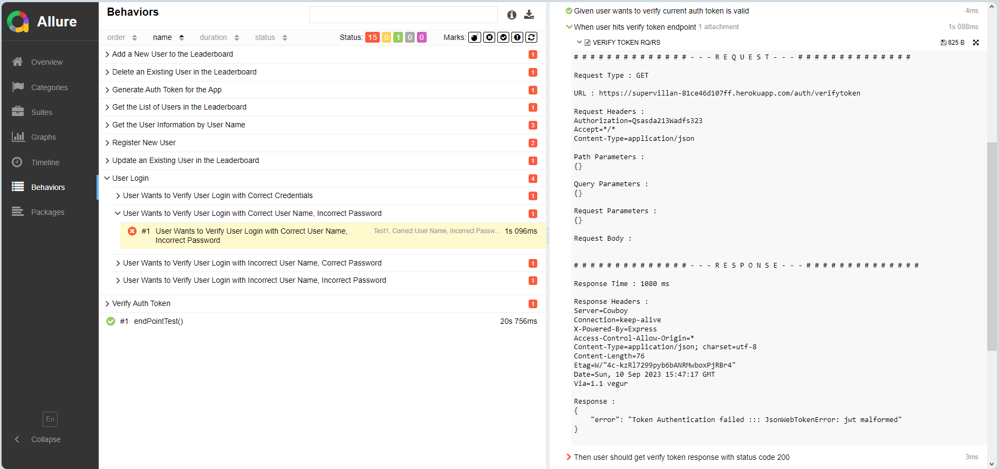